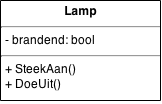

# Classes

Een class bestaat (o.a.) uit:

- (instantie-)variabelen
- methodes

> **Lokale** variabelen zijn lokaal aan een methode en behoren dus niet
tot de klasse.

De **variabelen** houden de *interne toestand* v.h. object bij.
De buitenwereld heeft er geen zaken mee: **encapsulatie**.

De **methodes** (en properties) zijn de *interface* v.h. object 
naar de buitenwereld, wat we er mee kunnen doen.
Hierbij gebruiken we voor methods meestal **werkwoorden**
(en voor properties **eigenschappen v.h. object**).

> Denk b.v. aan een `TextBox`. Er zijn properties zoals
`Visible` en `BackgroundColor` en methods zoals `Clear()`.

Een voorbeeld, de class `Lamp`:



- 1 instantie-variabele `brandend`
- 2 (publieke) methodes : `SteekAan()` en `DoeUit()`

```
class Lamp {
  private bool brandend; // instantie-variabele
  
  public void SteekAan() { // methode
    brandend = true;
  }
  
  public void DoeUit() {
    brandend = true;
  }
}
```

Iemand die deze class wil gebruiken, kan dit doen als volgt:

> In dit code-fragment maken 2 objecten van type `Lamp` : `bureaulamp`
en `leeslamp`. Vervolgens roepen we een paar methods aan van elk object.
Door het aanroepen van die methods, verandert de **interne toestand** v.d.
class, nl. de instantie-variabele `brandend` zal beinvloed worden.

```
Lamp leeslamp = new Lamp();
Lamp bureaulamp = new Lamp();

leeslamp.SteekAan();
bureaulamp.SteekAan();
bureaulamp.DoeUit();
```


# Access Specifiers

Elk element van een class, heeft een bepaalde *toegang* of *access* :

- public
- private
- protected

> Naast variabelen en methodes, kunnen ook classes zelf
 een access specifier hebben. Je kan immers
ook een class in een andere class steken. Dit zullen wij zelden doen.


## Public

Iedereen kan er aan.

Standaard zijn methodes `public`.

Echter, soms wil je een methode die enkel binnen de class gebruikt wordt.
Dan maak je deze `private`.

> Public methods bepalen de *interface naar buiten toe* v.d. class.


## Private

Enkel de class zelf kan er aan.

Standaard zijn instantie-variabelen `private`.

In principe maak je **nooit** je instantie-variabelen `public` !
In de plaats gebruik je methods of Properties!

> Je gebruikt private variabelen en methods om de *interne keuken* v.d. class
te regelen.

Private members zijn belangrijk om **encapsulatie** te bewerkstelligen.


## Protected

Enkel overervende classes kunnen er aan (en natuurlijk de class zelf).

Dit doe je voornamelijk voor variabelen die je ook wil veranderen
in overervende classes.
Toch kan het gebruik van Properties hier soms ook beter zijn.

