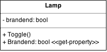
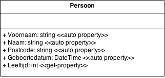

# Lamp

- Maak een nieuw WPF project.
- Voeg de class `Lamp` toe aan het project in een apart bestand `Lamp.cs`.

```
class Lamp {
  private bool brandend; // instantie-variabele
  
  public void Toggle() // method
  {
    brandend = !brandend;
  }

  public bool Brandend {
    get { return brandend; } // get-property
  }
}
```

Het UML class diagram ziet er zo uit:



> Gebruikers van deze `Lamp` kunnen dus enkel:
> - de lamp `Toggle`n (aan of uit schakelen, afh. van vorige toestand)
> - opvragen of de lamp momenteel brandt via de `Brandend`-property

> We kunnen de lamp niet laten branden via de property, omdat er 
geen set-property is geimplementeerd. Dit doen we bewust! De maker
v.d. `Lamp` beslist hoe de `Lamp` gebruikt moet worden.

We maken nu een soort UI voor een domotica-systeem.

- een schakelaar stellen we voor door een `Button`
- een lamp stellen we voor door een `TextBlock` (van ongeveer 20x20 pixels)
waarbij **geel** duidt op een brandende lamp en **zwart** op een lamp die uit 
is

Doe het volgende:

- Maak minstens 2 `Lamp`-objecten: `keukenLamp` en `woonkamerLamp`.
Implementeer ze als instantie-variabelen v.h. venster (`MainWindow`).
- Maak minstens 2 schakelaars (de `Button`s): `keukenButton` en
`woonkamerButton` en 2 lamp-voorstellingen (de `PictureBox`'n):
`keukenLampControle`, `woonkamerLampControle`

- Telkens als op **een** knop gedrukt wordt, moeten we de status
v.d. lampen controleren. We zouden dit eventueel ook in een Timer
kunnen doen, die voortdurend de huidige status v.d. lampen opvraagt.


# Persoon

Schrijf een class `Persoon` met volgende automatische properties:

- `Voornaam`
- `Naam`
- `Postcode`
- `Geboortedatum` (van type `DateTime`)

Zorg ook voor een get-property waarmee de leeftijd kan opgevraagd worden:

- `Leeftijd`

Het UML class-diagram ziet er dus zo uit:




