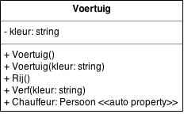

# Voertuig

Schrijf een class `Voertuig`.

De publieke interface van `Voertuig` is als volgt:



- een constructor zonder parameters
- een constructor met een `string`-parameter `kleur`
- een method `Rij()`
- een method `Verf(string kleur)`
- een set- en get-property `Chauffeur` van type `Persoon`

`Voertuig` heeft een private class-variabele `kleur` die in een string bijhoudt
welke kleur het voertuig heeft.

Als een nieuw voertuig gemaakt wordt, b.v.

```
Voertuig auto = new Voertuig();
```

dan is de kleur standaard **rood**.

Als bij het maken v.h. Voertuig een kleur wordt meegegeven met de constructor,
krijgt het voertuig deze kleur, b.v.

```
Voertuig groeneAuto = new Voertuig("groen");
```

De kleur van het voertuig kan nadien enkel verandert worden met de method 
`Verf`, b.v.

```
auto.Verf("geel");
```

Verder kan je met een auto rijden, als er een chauffeur inzit.
Hiervoor gebruik je een automatic property `Chauffeur` van type `Persoon` (uit
de vorige oef.).

```
Persoon jos = new Persoon();

jos.Voornaam = "Jos";
jos.Achternaam = "Bosmans";
jos.Geboortedatum = new DateTime(1990, 1, 1);

auto.Chauffeur = jos;
auto.Rij();
```

De method `auto.Rij()` geeft volgende output 
`De chauffeur (Jos Bosmans, 25 jaar), rijdt met de auto (kleur: rood)`.

```
auto.Chauffeur = null;
auto.Rij();
```

Als er geen chauffeur aanwezig is, geeft `auto.Rij()` de volgende output: 
`Voertuig kan niet rijden - geen chauffeur aanwezig!`
