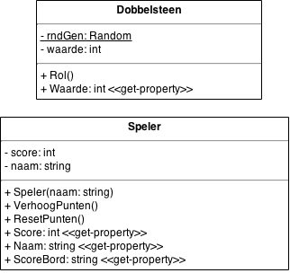

# Info: UML class diagramma's

Wat je moet weten over UML class diagramma's:

- de bovenste kader toont alle **variabelen**
- de onderste kader toont alle **methodes** en **properties**
- de access specifiers `public` en `private` worden voorgesteld door
respectievelijk `+` en `-`
- een **onderlijnde** member (method of variabele) is **static**
- het type v.e. variabele staat steeds achter de naam v.d. variabele, b.v. 
`naam: string`
- ook return-types worden aangegeven achter een `:`, staat er niets dan is het
return-type dus `void`
- men gebruikt soms `<< ... >>` om extra info te geven, b.v.

  - <<get-property>> als er enkel een get-property is
  - <<property>> voor zowel een get- als set-property
  - ...

> Er is geen standaard manier om properties in UML weer te geven.

  
# Oef. Dobbelspel

In een UML class diagramma worden class schematisch voorgesteld.
Dit soort diagramma's zijn een hulp om na te denken.

Bouw deze classes na:

Deze UML classes zijn bijna een 1-op-1 vertaling v.d. code:

- `rndGen` is `private` en `static`
- `waarde` is `private`
- `Waarde` is een public-get-property
- `Speler(naam: string)` is een constructor (want heeft dezelfde naam als de
class) met 1 parameter: `naam`
- ...

> Gebruik dergelijke UML-diagrammen om je een beeld te vormen van de applicatie,
> vooraler je begint te coderen. Je kan mag achteraf (bij het refactoren) altijd
> afwijken van je UML-diagramma. Het is niet zo heel erg als dat het
> UML-diagramma *verouderd* geraakt.

  
# Oef dobbelspel 2

Gebruik de classes `Speler` en `Dobbelsteen` om een console-spel te maken waar
de gebruiker steeds moet proberen te raden welke getal zal gegooid worden. Elke
keer als hij juist raadt, wordt de score v.d. speler met 1 verhoogd. Het spel
stopt als de speler `stop` ingeeft i.p.v. een getal.

