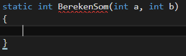

# Compiler-fouten : code-paden

Tijdens het schrijven van methods met een return-waarde kan de compiler een
code-path error geven.

Het invoeren van deze code:

```cs
static int BerekenSom(int a, int b)
{

}
```

ziet er in Visual Studio zo uit:



en je krijg deze error:


Dit kan je oplossen door een standaard return-waarde op te geven.

In dit geval moeten we een `int` returnen, dus is `0` een goede standaard
waarde :

```cs
static int BerekenSom(int a, int b)
{
    return 0;
}
```

De compiler zal nu alvast geen foutmelding meer geven en je zou de method al
kunnen aanroepen, b.v. met `int x = BerekenSom(2, 3);`. Het programma kan nu ook
uitgevoerd worden!

> Uiteraard zal de functie nog niet naar behoren werken!

Nu kan je de eigenlijke implementatie van `BerekenSom` doen:

```cs
static int BerekenSom(int a, int b)
{
    int som = a + b;
    return som;
}
```


# Oefening

- Maak een nieuwe Console-applicatie
- Implementeer de methode `BerekenSom` en let op de compiler-errors
- Roep de methode `BerekenSom` enkele malen aan vanuit `Main`:
  - om de som van `2` en `3` te berekenen en weer te geven
  - om de som van `11` en `12` te berekenen en weer te geven


# Wat zijn code-paden?

Het vorige voorbeeld heeft maar 1 code-pad.

De volgende method heeft door de `if`-`else` 2 code-paden.

De methode `DeelbaarDoor5` controleert of een getal deelbaar is door 5, de
return-waarde is een `bool`:

```cs
static bool DeelbaarDoor5(int getal) {
  if(getal % 5 == 0) {
    return true;
  }
  return false;
}
```

Afhankelijk van het resultaat van `getal % 5 == 0` wordt een ander code-pad
gevolgd.

