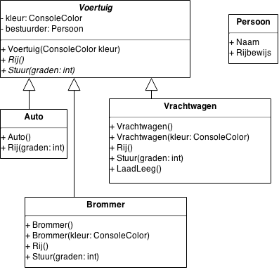

# GtaConsole

Doel: een Console-versie van GTA waarin Voertuigen voorkomen.

Het eindresultaat zou er zo uit kunnen zien:



Gebruik de `Console2`-class om gekleurde tekst af te printen.
(Let er op dat de juiste namespace gebruikt wordt zodat `Console2` kan
gevonden worden.)

> Console2 ondersteunt het gebruik van een *accentedColor*.
Alle tekst die in de string tussen {{ en }} staat, zal in de 
*accentedColor* worden afgedrukt.


Voertuigen hebben standaard een bepaalde kleur :

- auto: `DarkYellow`
- vrachtwagen: `Green`
- brommers: `Magenta`

maar kunnen ook in een specifieke kleur gemaakt worden
(met een constructor).


## Opgave

```
using System;
using System.Collections.Generic;
using System.Linq;
using System.Text;
using System.Threading.Tasks;

namespace GTAConsole
{
    class Voertuig
    {
        private ConsoleColor kleur;

        public Voertuig(ConsoleColor kleur)
        {
            this.kleur = kleur;
        }

        public virtual void Rij()
        {
            Console2.WriteLine("Het {{voertuig}} rijdt...", ConsoleColor.White, kleur);
        }

        public virtual void Stuur(int graden)
        {
            Console.WriteLine("");
        }
    }

    class Auto : Voertuig
    {
        public Auto() : base(ConsoleColor.DarkYellow)
        {
        }

        public override void Rij()
        {
            Console2.WriteLine("De auto rijdt...", ConsoleColor.Red);
        }
    }

    class Vrachtwagen : Voertuig
    {
        public Vrachtwagen()
            : base(ConsoleColor.Green)
        {
        }

        public override void Rij()
        {
            Console2.WriteLine("De vrachtwagen rijdt...", ConsoleColor.Red);
        }

        public override void Stuur(int graden)
        {
            Console.WriteLine("De vrachtwagenchauffeur kijkt in zijn dode-hoek-spiegel");
            base.Stuur(graden);
        }

        public void LaadLeeg()
        {
        }
    }
	
    class Program
    {
        static void Main(string[] args)
        {
            Voertuig v = new Voertuig(ConsoleColor.Magenta);
            Voertuig truck = new Vrachtwagen();

            v.Rij();
            truck.Rij();

        }
    }
}
```


## Oef 1

Maak een nieuw Console-project en gebruik de bestanden `Program.cs`
en `Console2.cs` om een **werkend** project te krijgen.


## Oef 2

De classes `Voertuig`, `Auto` en `Vrachtwagen` staan nu allemaal nog in
`Program.cs`. Geef ze elk hun eigen bestand zodat de code overzichtelijker
wordt.


## Oef 3

Voeg een class `Brommer` toe. Deze moet 2 constructors hebben:

- 1 constructor die zonder parameters wordt aangeroepen en altijd een MAGENTA
brommer maakt
- 1 constructor die met een parameter `kleur` wordt aangeroepen en een brommer
van die kleur maakt.

TIP: 
- De body van de method mag geen code bevatten!

## Oef 4

De `Rij()`-methode van Auto's en Vrachtwagens gebruikt nu nog altijd rood, 
terwijl we ze de juiste kleur zouden moeten laten gebruiken.

TIP:
- De class-variabele `kleur` van `Voertuig` moet toegankelijk zijn in de
overervende classes. Helaas is deze nu nog `private`. Wat kan je doen om deze
variabele **enkel in de overervende classes** beschikbaar te maken?


## Extra

Breidt zelf de classes verder uit, b.v.

- Maak een class `Persoon` (en overervende classes `Man` en `Vrouw`) met een
aantal properties, zoals `Naam`.
- Geef een `Voertuig` een property `Chauffeur` van type `Persoon` en zorg
ervoor dat de naam v.d. chauffeur wordt weergegeven als met een voertuig
gereden wordt (b.v. `Jos rijdt met de brommer`). (Zie ook oef. hst. 10)


## Oef 5 (abstracte classes)

> Maak hiervoor eerst een kopie van het project! Het zou spijtig zijn als je
een werkend project terug om zeep gaat helpen!

Maak de class `Voertuig` en de `Rij()`-method abstract.
Bijgevolg kan men niet rechtstreeks een Voertuig meer maken maar moet men een 
concreet Voertuig (b.v. een Brommer) kiezen.
Test dit uit in de `main`-method.
